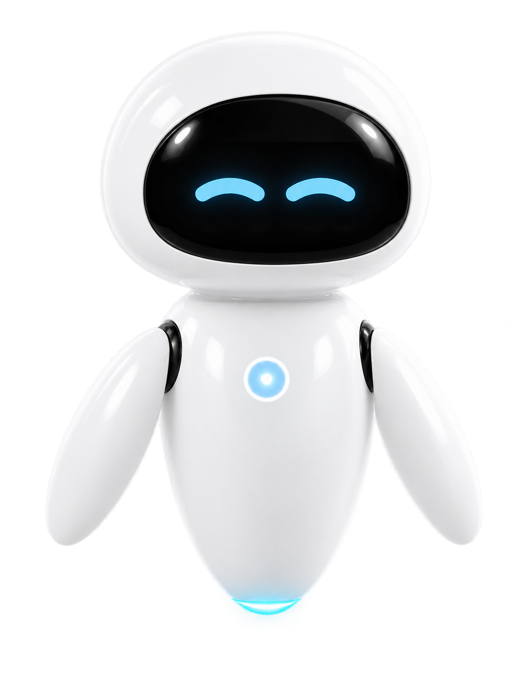

# 伊娃桌面宠物 · Mac 2.0.3

<table align="center">
  <tr>
    <th>应用图标</th>
    <th>高清桌面宠物切图</th>
  </tr>
  <tr>
    <td align="center" valign="middle">
      
    </td>
    <td align="center" valign="middle">
      
    </td>
  </tr>
</table>

<p align="center">
  一位温暖、轻量、会回应你的原生 macOS 桌面机器人伙伴。
</p>

<p align="center">
  <a href="https://github.com/wangkaikaise/Eva-Desktop-Pet/releases/latest"></a>
  
  
  <a href="LICENSE"></a>
</p>

伊娃以白色机身、黑色面屏和蓝色柔光构成简洁的三色形象，悬浮在桌面上陪伴工作。她拥有连续动作、表情反馈、拖动与点击互动、性能信息卡片、玻璃光效和日常提醒，并通过原生菜单栏提供快速控制。

> [下载最新版 Mac 2.0.3](https://github.com/wangkaikaise/Eva-Desktop-Pet/releases/latest) · 下载 ZIP，解压后将应用拖入“应用程序”文件夹。

## 核心功能

### 桌面伙伴与动作系统

- 待机、巡航、开心、玩耍、休眠五种长周期连续动画
- 每种状态拥有对应的眼睛表情、身体姿态、胸前柔光和自然过渡
- 巡航表现为缓慢飞行；玩耍时变为三色小火箭，沿连续“8”字轨迹飞行
- 开心、平静、疲惫、烦躁、低落、专注六种情绪，可手动或每 15、30、60 分钟切换
- 动作采用统一角色骨架，胸前单个圆形核心始终保持在身体中轴

### 点击、拖动与菜单栏互动

- 点击伊娃会随机进入当前状态之外的另一种动作
- 拖动时窗口与鼠标同步移动，并根据上、下、左、右方向改变姿态、尾迹与阴影
- 小火箭玩耍状态同样支持直接拖动，尾焰会跟随拖动轨迹变化
- 右键可快速选择动作；菜单栏头像可显示、隐藏伊娃并打开设置
- 菜单栏使用 macOS 模板图标，自动适配浅色、深色和选中状态

### 玻璃光效与外观设置

- 透明玻璃悬浮光池代替实体底座，支持亮度调节
- 柔光环、安心泡泡、守护轨道三种防护罩风格
- 可调整角色尺寸、整体透明度、动作速度和窗口置顶状态
- 眼睛使用明亮浅蓝动态表情，面罩遮罩严格保持在原面屏内部

### 电脑性能信息

- 显示 CPU 占用率、系统热状态、GPU 占用率和可用的 GPU 温度状态
- 卡片可固定在伊娃上、下、左、右四个标准锚点，避免遮挡角色
- 玻璃背景与内容透明度独立可调，背景支持完全透明
- 支持圆体、系统、等宽字体，以及白色、蓝色、黑色文字
- 支持 2、5、10 秒刷新间隔；关闭卡片后停止采样以减少资源占用

### 提醒、启动与隐私

- 支持每日定时以及每 15–120 分钟重复的喝水、活动、护眼和待办提醒
- 支持登录 macOS 后自动启动
- 采用 20–30 FPS 自适应渲染，静态状态降低刷新频率
- 设置、提醒和性能数据均保存在本机，不上传个人数据

## 应用架构

应用采用原生 SwiftUI 与 AppKit 混合架构。SwiftUI 负责角色、设置与动画视图；AppKit 负责透明悬浮窗口、菜单栏和桌面级交互；状态、提醒和系统指标以独立服务管理。

| 层级 | 源码模块 | 职责 |
| --- | --- | --- |
| 应用入口 | `EvaDesktopPetApp.swift`、`AppDelegate.swift` | 生命周期、透明 `NSPanel`、菜单栏、设置窗口与全局显示控制 |
| 角色表现 | `PetView.swift`、`RobotAsset.swift` | 角色渲染、动作、动态眼睛、玻璃光效、点击和方向感知拖动 |
| 状态模型 | `Models.swift`、`PetSettings.swift` | 动作、情绪、外观、指标位置、提醒规则与 `UserDefaults` 持久化 |
| 系统服务 | `SystemMetrics.swift` | CPU/GPU 指标采样、系统热状态和不可用数据的安全降级 |
| 提醒服务 | `ReminderManager.swift` | 通知授权、定时提醒的创建、更新与取消 |
| 设置界面 | `SettingsView.swift` | 外观、动作、性能卡片、提醒和登录启动配置 |

状态更新由 `ObservableObject` 驱动并通过 SwiftUI 响应式刷新；悬浮窗口与菜单栏由 `AppDelegate` 统一管理，避免角色视图承担系统生命周期职责。系统指标与提醒均可关闭，不使用时不进行无意义采样或调度。

## 开发技术栈

| 技术 | 用途 |
| --- | --- |
| Swift 6 toolchain / Swift 5 language mode | 原生应用、并发兼容与 Swift Package 构建 |
| SwiftUI | 角色界面、设置面板、动画和响应式状态绑定 |
| AppKit | 透明无边框 `NSPanel`、菜单栏 `NSStatusItem`、鼠标与窗口控制 |
| Combine | 设置、运行状态和系统数据的发布与订阅 |
| UserNotifications | 本地喝水、活动、护眼与待办通知 |
| ServiceManagement | 登录后自动启动 |
| Darwin Mach API | CPU 占用率统计 |
| IOKit / IORegistry | 当前设备可用的 GPU 性能统计 |
| UserDefaults | 本地偏好与提醒配置持久化 |
| Swift Package Manager | 依赖、构建、测试与工程组织 |

## Mac 2.0.3 当前版本说明

- 完成五状态统一动作与动态眼睛系统，动作切换更连贯、持续时间更自然
- 修复拖动卡顿，普通状态和小火箭玩耍状态均可跟手移动
- 优化脸部动态眼睛遮罩，移除黑色圆柱与凸起，保持完整面屏轮廓
- 眼睛只做适度加粗和轻微加长，以清晰浅蓝保持动作辨识度
- 小火箭与标准角色采用互斥渲染，彻底移除进入和退出玩耍时的原图闪现
- 玩耍粒子随状态立即结束，不再在眼睛周围留下点状残影
- 胸前统一为居中的单个圆形核心，并以低饱和柔光随动作变化
- 性能卡片支持四向标准位置、完全透明背景、字体、颜色和透明度设置
- 休眠提示、玻璃防护罩、悬浮光池和菜单栏头像完成统一设计

## 系统要求与安装

- macOS 13 或更高版本
- Apple Silicon Mac（当前 Release 为 arm64 构建）

从 [Releases](https://github.com/wangkaikaise/Eva-Desktop-Pet/releases/latest) 下载 ZIP，解压后将 `Eva Desktop Pet.app` 拖入“应用程序”文件夹。当前公开包使用 ad-hoc 签名；若 macOS 首次阻止启动，请在“系统设置 → 隐私与安全性”中确认打开。

## 使用方法

1. 启动应用，伊娃会出现在主屏幕右下角。
2. 点击伊娃触发随机回应，拖动可调整位置，右键可直接选择动作。
3. 点击菜单栏的伊娃头像，可显示、隐藏角色或打开设置。
4. 在设置中配置动作、情绪、玻璃光效、性能卡片和提醒。
5. 首次创建提醒时允许系统通知权限。

## 本地开发

需要 macOS 13+ 与 Xcode 16+，或带 Swift 6 工具链的开发环境。

```bash
swift run EvaDesktopPet
swift test
```

在 Xcode 中可选择 `File > Open`，直接打开仓库根目录的 `Package.swift`。

### 构建 `.app`

```bash
chmod +x scripts/build-app.sh
./scripts/build-app.sh release
open "dist/Eva Desktop Pet.app"
```

脚本会执行 release 构建、组装 `.app` 并进行本机 ad-hoc 签名。正式商业分发应改用 Apple Developer ID 签名，并完成 Apple notarization。

## 性能数据说明

CPU 占用率来自公开的 Mach 主机统计接口。GPU 占用率读取当前机型可用的 IORegistry 性能统计，部分机型可能不提供。macOS 没有向普通第三方应用开放统一、公开的 CPU/GPU 摄氏温度接口，因此应用会显示 Apple 提供的系统热状态，并对无法取得的数据明确标记为系统限制，不猜测或伪造温度。

## 视觉资产与许可

白色悬浮机器人视觉为本项目原创 AI 辅助生成资产，采用一体化白色机身、黑色面屏和蓝色光效。代码使用 [MIT License](LICENSE)；视觉资产仅随本项目使用和再分发。
