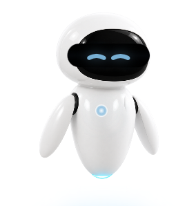

# 伊娃桌面宠物 · Windows 13.3.1

Windows 10/11 桌面伴侣，基于 Python 3.13、PySide6 与 Windows 原生窗口接口。
设计与交互对齐 Mac 2.0.3：温暖的白色悬浮机器人、五种连贯动作、可拖动的小火箭、
四向性能卡片、提醒、情绪与玻璃光效。



## 核心功能

- 五种动作：待机、巡航、开心、玩耍小火箭、休眠；点击随机切换到其他状态。
- 普通形态和火箭形态都可直接拖动，窗口位置 1:1 跟手，尾气随方向变化。
- 每种动作拥有对应眼睛和低饱和胸部光色，形态过渡使用交叉淡化，避免闪图。
- 防护罩、底部玻璃光池、情绪自动切换和陪伴文案。
- CPU/GPU 占用率、CPU/GPU 温度卡片，支持上、下、左、右、系统字体、8–18 pt 字号、文字颜色和完全透明背景。
- 每日或间隔提醒、开机启动、单实例和随系统明暗主题切换的托盘头像。

## 架构

- `main.py`：DPI、单实例、日志和应用入口。
- `eva_window.py`：透明窗口、直接拖动、分层渲染、托盘与设置协调。
- `state_machine.py`：动作、情绪、姿态、过渡与拖动方向。
- `metrics.py`：后台性能采样；NVIDIA 使用 `nvidia-smi`，其他 GPU 使用 Windows GPU 性能计数器。
- `settings.py` / `settings_dialog.py`：本地 JSON 设置和设置界面。
- `reminders.py`：每日与间隔提醒调度，支持睡眠恢复后的单次补发。
- `assets/`：高清运行时纹理、SVG 特效、应用和托盘图标。

## 本地开发

```powershell
py -3.13 -m venv .venv
.venv\Scripts\python -m pip install -r requirements-dev.txt
.venv\Scripts\python -m pytest
.venv\Scripts\python main.py
```

CPU 温度使用可选的 LibreHardwareMonitor + PawnIO 扩展。程序主体始终以普通用户权限运行；
首次启用温度时，独立助手请求 UAC 并在管理员上下文安装驱动，成功采样后立即刷新卡片。
硬件确实不提供受支持传感器时会明确显示“不可用”，不会猜测温度。

## 构建 Windows x64 发布包

```powershell
powershell -ExecutionPolicy Bypass -File scripts\build_windows.ps1
```

构建脚本会运行全部测试，从第三方官方 GitHub Release 下载固定版本的硬件监控组件、校验
SHA-256，然后使用 PyInstaller 生成 one-folder 包和 ZIP。产物位于 `dist/`。

完整的视觉、动作、功能与验收标准见
[EVA_WINDOWS_DEVELOPMENT_SPEC.md](EVA_WINDOWS_DEVELOPMENT_SPEC.md)，第三方许可见
[THIRD-PARTY-NOTICES.md](THIRD-PARTY-NOTICES.md)。

## 隐私与权限

- 设置与提醒仅写入 `%LOCALAPPDATA%\EvaDesktopPet`。
- 不联网、不上传硬件数据、不包含遥测。
- 基础功能不要求管理员权限。
- 商业发布前仍需独立完成名称、角色外观、代码签名和第三方许可审查。
